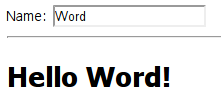
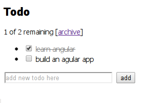
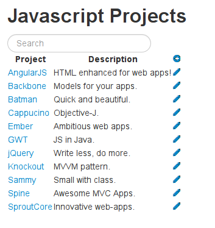
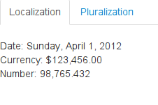

##  Hello world

  -  To show how simply to define a model
  -  To show model change affect view easily in angular

## Todo

  - To show how define complex model with attribute
  - To show how render repeat list of models(collection)
  - To show how view action/event reflect to model and model's view. (i.e. how to define controller)

## Projects

  - To show how to define module in angularjs
  - To show how to integerate a backend easily in angularjs
  - To show how to use controller/view template with html file in angularjs
  - To show how to Route path to controller
     
            
       
## Localization

  - To show how to define directive(tags with new semantics) in angularjs
  - To show how use the new directive, interactive between directives, and between module and directive.
  
